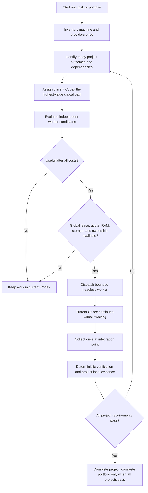

# Capacity-Aware Resource Orchestration

AI Mobile v1 is a finite allocation layer, not a background project manager. It converts one explicit request into one project task or a portfolio of independently verifiable projects.

## Decision Flow

## Capacity Evidence

Each provider record includes:

- executable and authentication evidence;
- advertised models and capabilities;
- quota pools, remaining percentage, and reset time when exposed;
- source, confidence, observation time, and expiry;
- recent success/failure history and cooldown state.

Machine evidence includes logical CPU count and free/total RAM. Worktree allocation also checks disk quota and minimum free space.

Fresh positive provider evidence is cached briefly. Negative evidence has a shorter lifetime and is always re-probed before a dispatch rejection. Unknown capacity remains unknown; it is not converted to zero or unlimited.

## Allocation Score

Routing considers:

1. dependency readiness and user priority;
2. capability fit for the work kind;
3. ownership independence from current Codex and other workers;
4. provider authentication and model eligibility;
5. quota pool remaining capacity and reset horizon;
6. recent reliability and typed failures;
7. subscription versus separately billed API cost;
8. free RAM, global worker limits, and worktree storage;
9. prompt, output, wait, verification, retry, and integration cost.

Current Codex remains a working agent. It owns the highest-value ready critical path and retains the configured shared-capacity reserve. Additional Codex CLI work is permitted only when measured capacity remains above that reserve.

## Portfolio Allocation

A portfolio stores:

- the portfolio outcome and allocation policy;
- one child task per project;
- each project's workspace, outcome, acceptance requirements, priority, blockers, and dependency work graph;
- project-local rounds, jobs, patches, evidence, and completion state;
- one shared capacity snapshot and machine-wide lease references.

Candidates are ordered by project priority and then round-robin fairness. A blocked project is skipped, not treated as complete, and does not prevent a ready sibling from advancing. Project evidence is written only to that project's child task.

## Machine-Wide Leases

Before an external worker starts, AI Mobile atomically acquires a local lease covering:

- one global worker slot;
- one provider slot;
- every applicable quota pool;
- the project fairness key;
- the finite worker deadline.

The lease is released on terminal worker exit, collection, cancellation, or stale-process cleanup. Separate tasks and portfolios share the same lease registry under `%LOCALAPPDATA%\AI Mobile\v1`, preventing cross-project oversubscription.

## Worktree Lifecycle

Editing workers require a Git repository root and use `git worktree add --detach`, so Git history is shared without copying `.git` objects or modifying the primary checkout. Read-only workers use the declared repository directly and create no worktree.

Before creation, the bridge checks configured worktree quota and minimum disk free space. Before patch capture, ignored and known transient dependency, cache, log, virtual-environment, coverage, and build paths are removed. Editing worktrees are removed:

- immediately after first terminal collection;
- on cancellation;
- when a worker process is lost;
- during MCP/CLI startup cleanup;
- after the configured maximum age;
- when creation would exceed storage limits.

The compact patch and evidence remain in central task state after worktree cleanup.

## No Background Runtime

AI Mobile advances only through explicit finite actions: start, dispatch, collect, record evidence, summarize, complete, or cancel. It creates no manager loop, heartbeat, Goal, automation, repeated status poll, or automatic desktop launch. Long work uses additional evidence-linked rounds initiated by the active Codex task.
